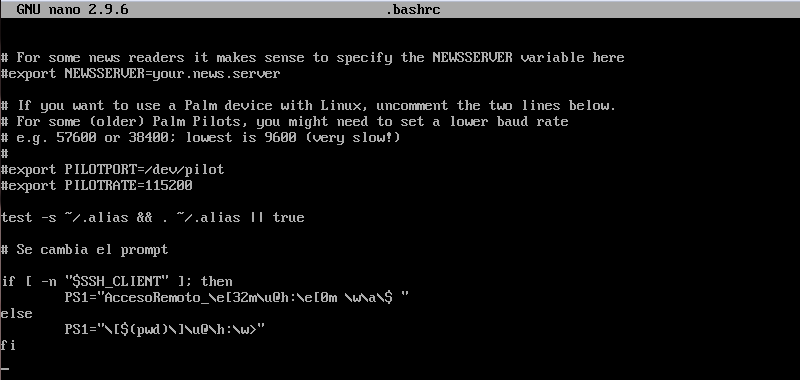
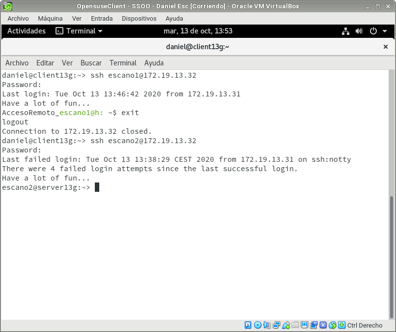

# Acceso remoto SSH  

2º ASIR - Daniel Escaño Hernández  

  

## 1. Servidor SSH  

Configurar el servidor GNU/Linux.

Para comprobar los cambios ejecutamos varios comandos:

#### Captura comprobacion de comandos (Server):
  

Crear 4 usuarios en serverXXg:

primer-apellido-del-alumno1
primer-apellido-del-alumno2
primer-apellido-del-alumno3
primer-apellido-del-alumno4

#### Captura creacion de usuarios (Server):
  

## 2. Instalacion del servicio SSH en GNU

Desde el propio servidor, verificar que el servicio está en ejecución.

systemctl status sshd, esta es la forma habitual de comprobar los servicios.

ps -ef|grep sshd, esta es otra forma de comprobarlo mirando los procesos del sistema.

#### Captura de la comprobacion de la instalacion:
  

Desde el cliente GNU nos conectamos mediante ssh 1er-apellido-alumno1@serverXXg.

#### Captura de la conexión SSH desde cliente GNU:
  

Desde el cliente Windows nos conectamos usando PuTTY.

#### Captura de la conexión SSH desde cliente Windows:
  

## 3. Cambiamos la indentidad del servidor

Modificar el fichero de configuración SSH (/etc/ssh/sshd_config) para dejar una única línea: HostKey /etc/ssh/ssh_host_rsa_key. 

Comentar el resto de líneas con configuración HostKey

#### Captura de la configuracion del servidor:
  

#### Captura de la comprobacion del cambio de identidad:
  

## 4. Personalizacion del promt Bash

Por ejemplo, podemos añadir líneas al fichero de configuración del 1er-apellido-alumno1 en la máquina servidor (Fichero /home/1er-apellido-alumno1/.bashrc)

#### Captura de la configuracion de .bashrc:
  

#### Captura de la comprobacion del cambio:
  

  

## 5. Autenticacion mediante claves publicas

#### Captura de la creacion de nuevas claves:
  

#### Captura del copiado de nuevas claves:
  

## 6. Uso de SSH como tunel para Geany

Instalar en el servidor una aplicación de entorno gráfico (APP1) que no esté en los clientes. Por ejemplo Geany. Si estuviera en el cliente entonces buscar otra aplicación o desinstalarla en el cliente.

Modificar servidor SSH para permitir la ejecución de aplicaciones gráficas, desde los clientes. Consultar fichero de configuración /etc/ssh/sshd_config (Opción X11Forwarding yes)

#### Captura del archivo de configuracion:
  

#### Captura del no funcionamiento desde la maquina cliente por su cuenta:
  

#### Captura de la comprobacion de la ejecucion desde la maquina cliente tras haber conexion:
  

## 7. Restricciones de uso

### 7.1 Restricción sobre un usuario

En el servidor tenemos el usuario primer-apellido2. Desde local en el servidor podemos usar sin problemas el usuario.

Vamos a modificar SSH de modo que al usar el usuario por SSH desde los clientes tendremos permiso denegado.

#### Captura del archivo de configuracion sshd_config:

#### Captura de la comprobacion de la sintaxis:

#### Captura de la comprobacion de la conexion:

### 7.2 Restricción sobre una aplicacion

Crear grupo remoteapps
Incluir al usuario 1er-apellido-alumno4 en el grupo remoteapps.

Lo hacemos con usermod -G remoteapps escano4

Localizar el programa APP1. Posiblemente tenga permisos 755.

Poner al programa APP1 el grupo propietario a remoteapps.

Poner los permisos del ejecutable de APP1 a 750. Para impedir que los usuarios que no pertenezcan al grupo puedan ejecutar el programa.

Comprobamos el funcionamiento en el servidor en local.

Comprobamos el funcionamiento desde el cliente en remoto

#### Capturas del proceso:

