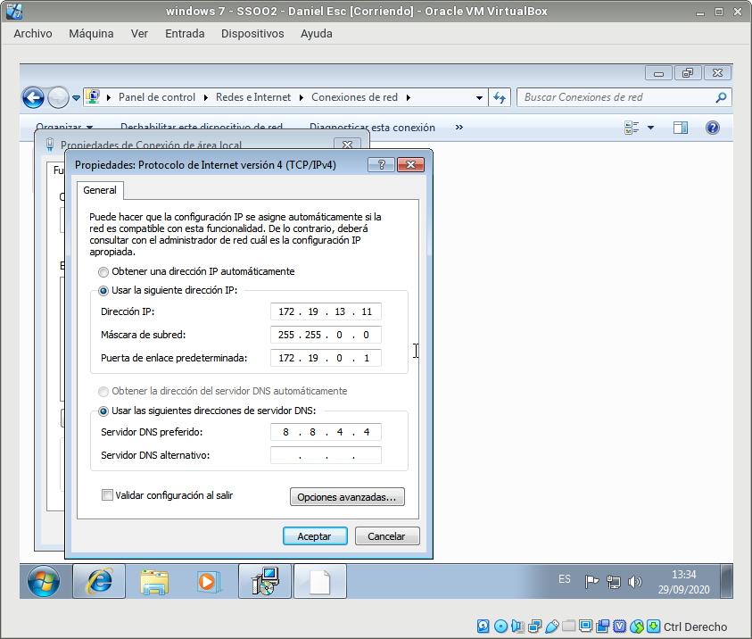
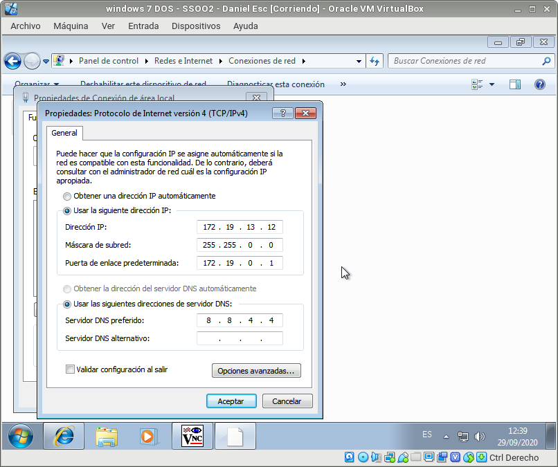
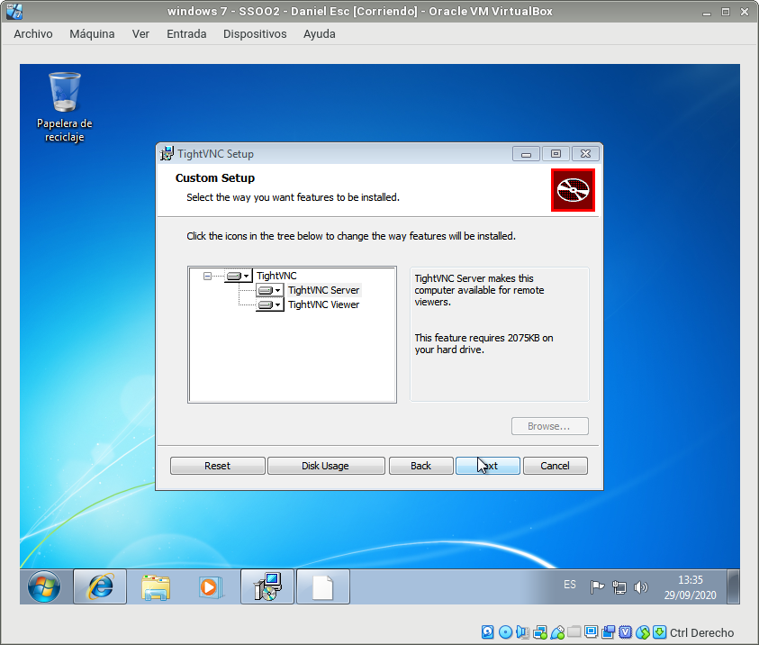
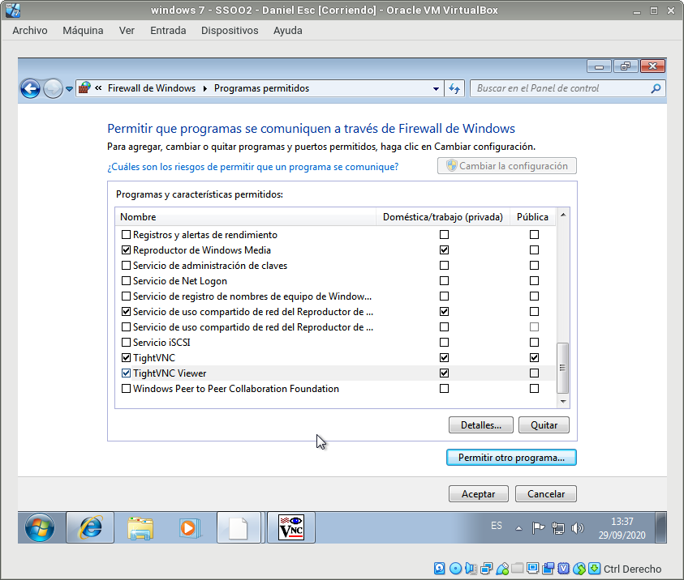
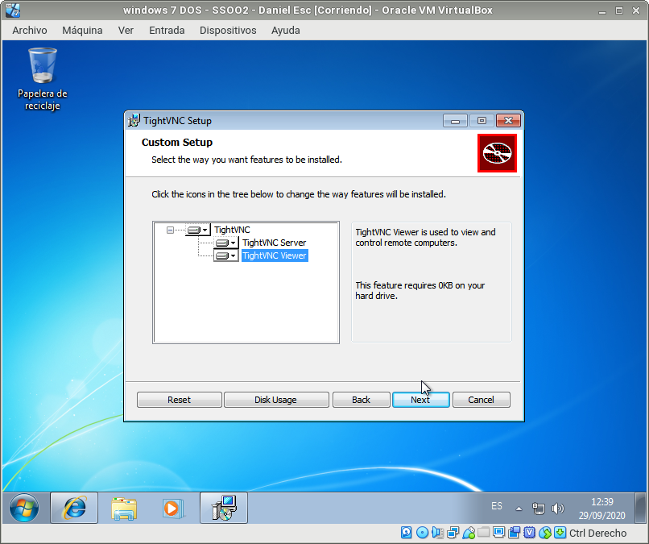
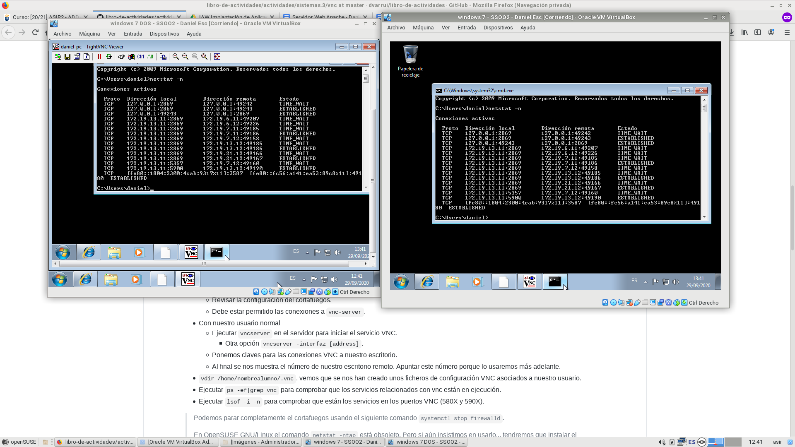

# Acceso remoto VNC  

2º ASIR - Daniel Escaño Hernández  

  

## 1. Windows: Slave VNC  

Configurar las máquinas virtuales según el documento dado.  

#### Captura configuración direccionamiento IP Windows 7 (Server):
  
  
  
#### Captura configuración direccionamiento IP Windows 7 (Viewer):
  
  
  
Descargar TightVNC. Esta es una herramienta libre disponible para Windows.  
  
En el servidor VNC instalaremos TightVNC -> Custom -> Server. Esto es el servicio.  
  
#### Captura de la instalación de TightVNC Server Windows 7 (Server):
  
  
  
Revisar la configuración del cortafuegos del servidor VNC Windows para permitir VNC.  
  
#### Captura de la configuración del cortafuegos para permitir VNC (Server):
  
  
  
## 2 Windows: Master VNC  
  
  
En el cliente Windows instalar TightVNC -> Custom -> Viewer.
  
Usaremos TightVNC Viewer. Esto es el cliente VNC.
  
  
#### Captura de la instalación de TightVNC Viewer Windows 7 (Viewer):

  
  
## 2.1 Comprobaciones finales
  
Conectar desde Window Master hacia el Windows Slave.
  
Ir al servidor VNC y usar el comando netstat -n para ver las conexiones VNC con el cliente.
  
  
#### Captura de la conexión desde Windows Master hacia Windows Slave y comando netstat:

