# Samba (con OpenSUSE y Windows)

2º ASIR - Daniel Escaño Hernández  

  

Vamos a necesitar las siguientes máquinas:

ID	Función	SSOO	IP estática	Hostname

MV1	Servidor	OpenSUSE	172.AA.XX.31	serverXXg

MV2	Cliente	OpenSUSE	172.AA.XX.32	clientXXg

MV3	Cliente	Windows	172.AA.XX.11	clientXXw

## 1. Servidor Samba (MV1)

### 1.1 Preparativos

Configurar el servidor GNU/Linux.

Nombre de equipo: serverXXg (Donde XX es el número del puesto de cada uno).

Añadir en /etc/hosts los equipos clientXXg y c.lientXXw (Donde XX es el número del puesto de cada uno).

### 1.2 Usuarios locales

Vamos a GNU/Linux, y creamos los siguientes grupos y usuarios locales:

Crear los grupos piratas, soldados y sambausers.

Crear el usuario sambaguest. Para asegurarnos que nadie puede usar sambaguest para entrar en nuestra máquina mediante login, vamos a modificar este usuario y le ponemos como shell /bin/false.

Dentro del grupo piratas incluir a los usuarios pirata1, pirata2 y supersamba.

Dentro del grupo soldados incluir a los usuarios soldado1 y soldado2 y supersamba.

Dentro del grupo sambausers, poner a todos los usuarios soldados, piratas, supersamba y a sambaguest.

#### Captura de la creacion de usuarios y grupos:

  

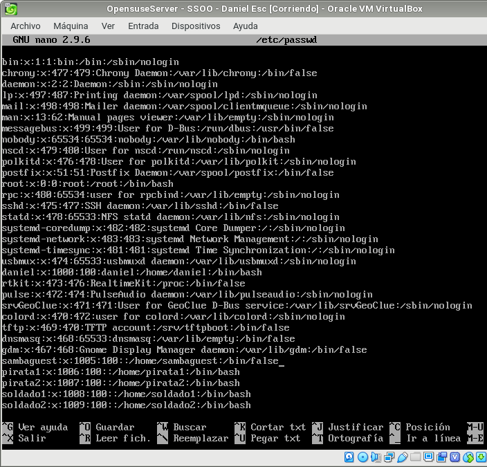  

### 1.3 Crear las carpetas para los futuros recursos compartidos

Creamos la carpeta base para los recursos de red de Samba de la siguiente forma:

mkdir /srv/sambaXX

chmod 755 /srv/sambaXX

Vamos a crear las carpetas para los recursos compartidos de la siguiente forma:

Recurso	Directorio	Usuario	Grupo	Permisos

Public	/srv/sambaXX/public.d	supersamba	sambausers	770

Castillo	/srv/sambaXX/castillo.d	supersamba	soldados	770

Barco	/srv/sambaXX/barco.d	supersamba	piratas	770

#### Captura de la creacion de carpetas y asignacion de permisos:

  

### 1.4 Configurar el servidor Samba

cp /etc/samba/smb.conf /etc/samba/smb.conf.bak, hacer una copia de seguridad del fichero de configuración antes de modificarlo.

Yast -> Samba Server

Workgroup: curso2021

Sin controlador de dominio.

En la pestaña de Inicio definimos

Iniciar el servicio durante el arranque de la máquina.

Ajustes del cortafuegos -> Abrir puertos

#### Captura de la asignacion de grupo de trabajo y configuracion del Firewall:

  

  

### 1.5 Crear los recursos compartidos de red

Vamos a configurar los recursos compartidos de red en el servidor. Podemos hacerlo modificando el fichero de configuración o por entorno gráfico con Yast.

Tenemos que conseguir una configuración con las secciones: global, public, barco, y castillo como la siguiente:

Donde pone XX, sustituir por el número del puesto de cada uno.

public, será un recurso compartido accesible para todos los usuarios en modo lectura.

barco, recurso compartido de red de lectura/escritura para todos los piratas.

castillo, recurso compartido de red de lectura/escritura para todos los soldados.

Podemos modificar la configuración:

Editando directamente el ficher /etc/samba/smb.conf

testparm, verificar la sintaxis del fichero de configuración.

more /etc/samba/smb.conf, consultar el contenido del fichero de configuración.

#### Captura del archivo de configuracion y comprobacion del fichero:

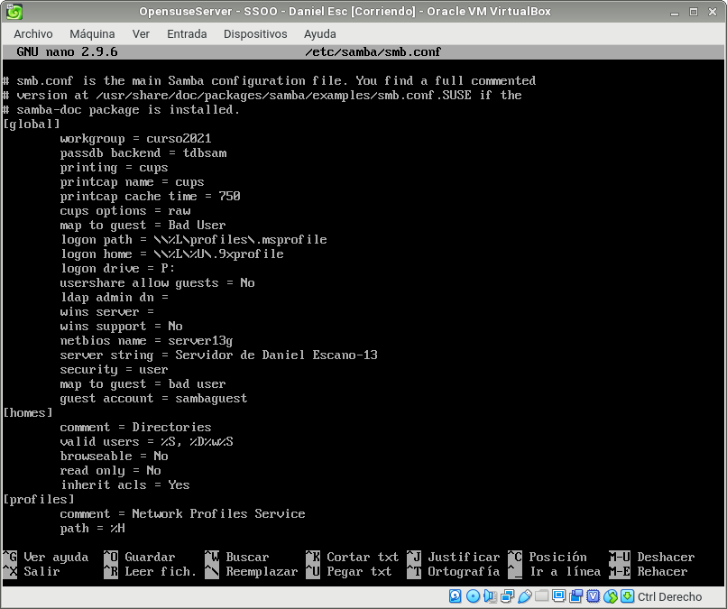  

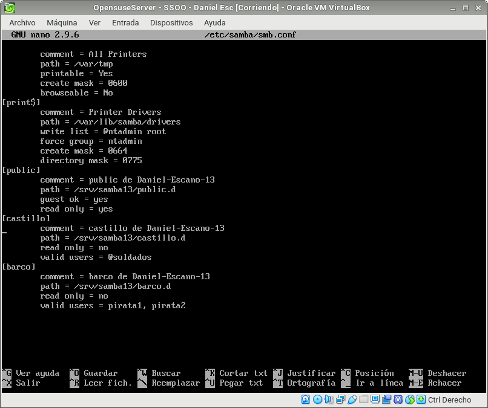  

  

### 1.6 Usuarios Samba

Después de crear los usuarios en el sistema, hay que añadirlos a Samba.

smbpasswd -a USUARIO, para crear clave Samba de USUARIO.

USUARIO son los usuarios que se conectarán a los recursos compartidos SMB/CIFS.

Esto hay que hacerlo para cada uno de los usuarios de Samba.

pdbedit -L, para comprobar la lista de usuarios Samba.

#### Captura de la creacion de las claves Samba:

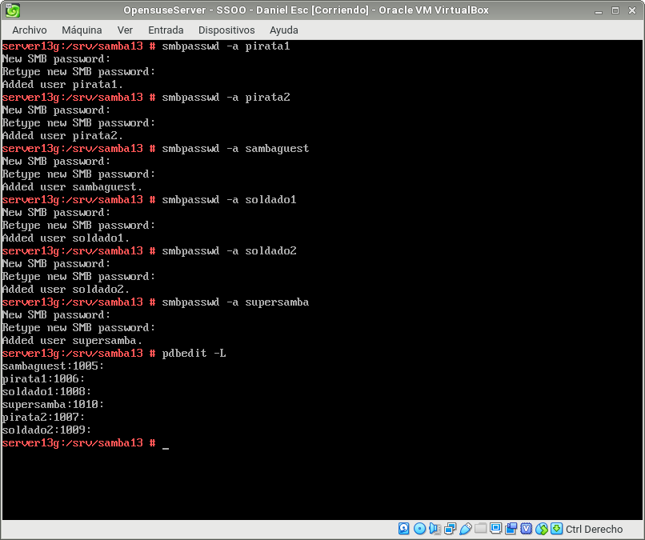  

### 1.7 Reiniciar

Ahora que hemos terminado con el servidor, hay que recargar los ficheros de configuración del servicio. Esto es, leer los cambios de configuración. 

Podemos hacerlo por Yast -> Servicios, o usar los comandos: systemctl restart smb y systemctl restart nmb.

sudo lsof -i, comprobar que el servicio SMB/CIF está a la escucha.

#### Captura del reinicio del servicio y comprobacion de que está a la escucha:

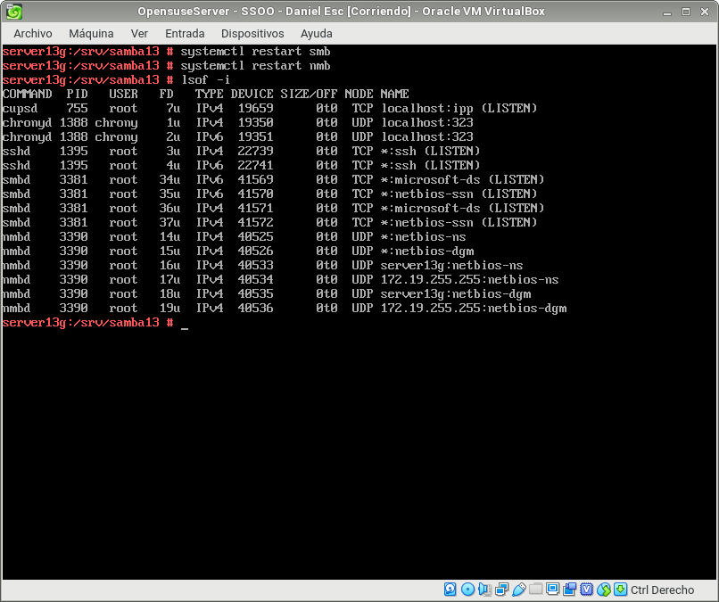  

## 2. Windows

Configurar el cliente Windows.

Usar nombre y la IP que hemos establecido al comienzo.

Configurar el fichero ...\etc\hosts de Windows.

En los clientes Windows el software necesario viene preinstalado.

### 2.1 Cliente Windows GUI

Desde un cliente Windows vamos a acceder a los recursos compartidos del servidor Samba.

Escribimos \\ip-del-servidor-samba y vemos lo siguiente:

samba-win7-cliente-gui

Acceder al recurso compartido public.

net use para ver las conexiones abiertas.

net use * /d /y, para borrar todas las conexión SMB/CIFS que se hayan realizado.

Acceder al recurso compartido castillo con el usuario soldado.

net use para ver las conexiones abiertas.

net use * /d /y, para borrar todas las conexión SMB/CIFS que se hayan realizado.
Acceder al recurso compartido barco con el usuario pirata.

Ir al servidor Samba.

Capturar imagen de los siguientes comandos para comprobar los resultados:

smbstatus, desde el servidor Samba.

lsof -i, desde el servidor Samba.

#### Captura del acceso a los recursos compartidos desde Windows y comprobacion desde el Servidor:

  

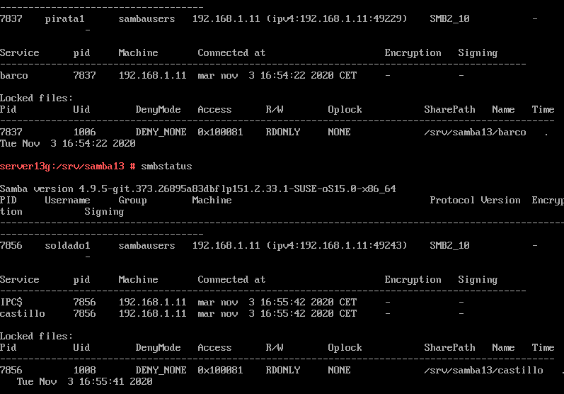  

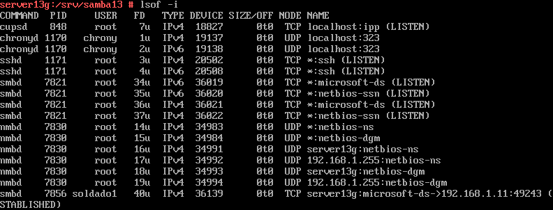  

### 2.2 Cliente Windows comandos

Abrir una shell de windows.

net use, para consultar todas las conexiones/recursos conectados hacemos. Con net use /?, podemos consultar la ayuda.

Si hubiera alguna conexión abierta la cerramos.

net use * /d /y, para cerrar las conexiones SMB.

net use ahora vemos que NO hay conexiones establecidas.

#### Captura de que no hay conexiones establecidas:

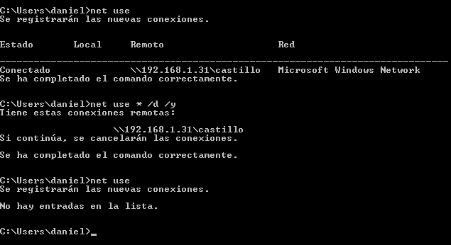  

Capturar imagen de los comandos siguientes:

net view \\IP-SERVIDOR-SAMBA, para ver los recursos del servidor remoto.

Montar el recurso barco de forma persistente.

net use S: \\IP-SERVIDOR-SAMBA\recurso contraseña /USER:usuario /p:yes crear una conexión con el recurso compartido y lo monta en la unidad S. 

Con la opción /p:yes hacemos el montaje persistente. De modo que se mantiene en cada reinicio de máquina.

net use, comprobamos.

Ahora podemos entrar en la unidad S ("s:") y crear carpetas, etc.

Capturar imagen de los siguientes comandos para comprobar los resultados:

sudo smbstatus, desde el servidor Samba.

lsof -i, desde el servidor Samba.

#### Captura del montado de forma persistente desde Windows y comprobacion desde el Servidor:

  

  

## 3 Cliente GNU/Linux

Configurar el cliente GNU/Linux.

Usar nombre y la IP que hemos establecido al comienzo.

Configurar el fichero /etc/hosts de la máquina.

### 3.1 Cliente GNU/Linux GUI

Desde en entorno gráfico, podemos comprobar el acceso a recursos compartidos SMB/CIFS.

Ejemplo accediendo al recurso prueba del servidor Samba, pulsamos CTRL+L y escribimos smb://IP-SERVIDOR-SAMBA:

Capturar imagen de lo siguiente:

Probar a crear carpetas/archivos en castillo y en barco.

Comprobar que el recurso public es de sólo lectura.

Capturar imagen de los siguientes comandos para comprobar los resultados:

sudo smbstatus, desde el servidor Samba.

sudo lsof -i, desde el servidor Samba.

#### Captura de la creacion de carpetas en recursos compartidos en Linux y comprobacion desde el Servidor:

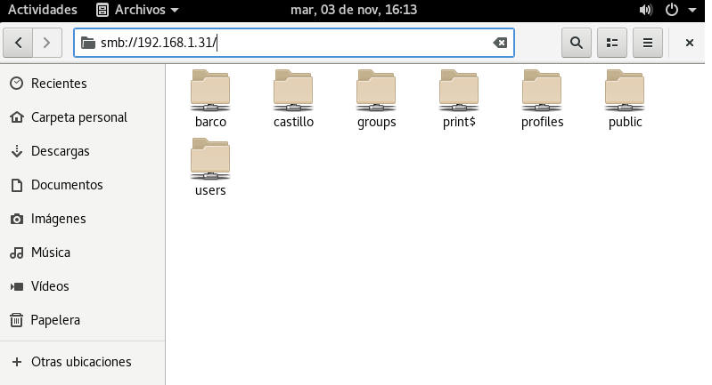  

  

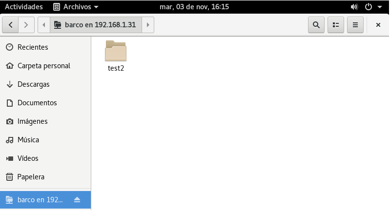  

  

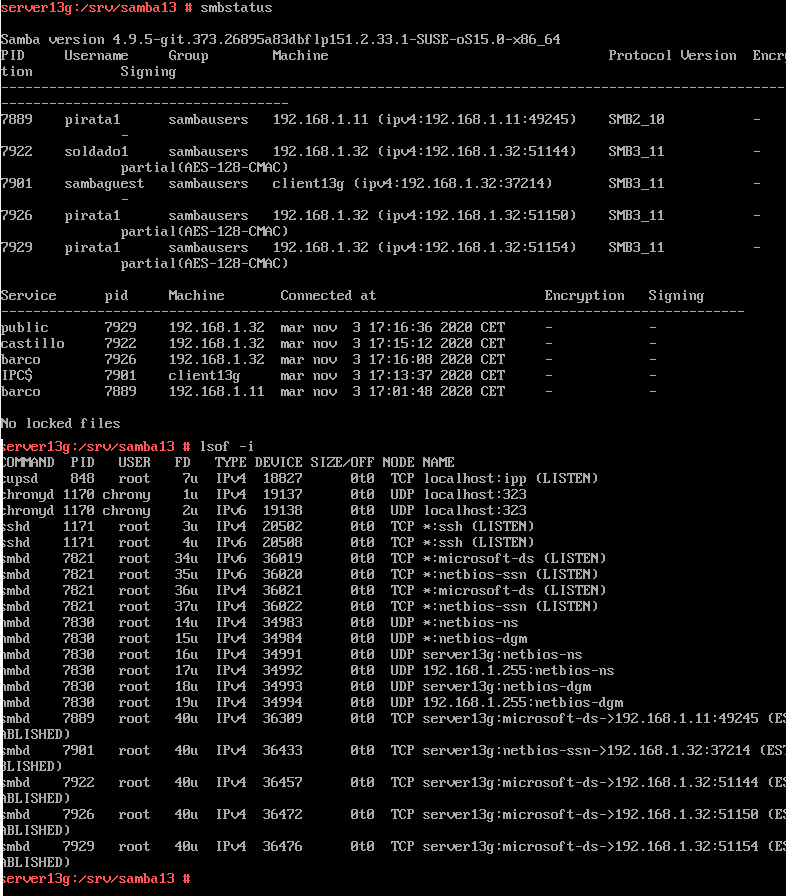  

### 3.2 Cliente GNU/Linux comandos

Capturar imagenes de todo el proceso.

Vamos a un equipo GNU/Linux que será nuestro cliente Samba. Desde este equipo usaremos comandos para acceder a la carpeta compartida.

Probar desde el cliente GNU/Linux el comando smbclient --list IP-SERVIDOR-SAMBA, que muestra los recursos SMB/CIFS del servidor remoto.

Ahora crearemos en local la carpeta /mnt/remotoXX/castillo.

MONTAJE MANUAL: Con el usuario root, usamos el siguiente comando para montar un recurso compartido de Samba Server,

 como si fuera una carpeta más de nuestro sistema: mount -t cifs //172.AA.XX.31/castillo /mnt/remotoXX/castillo -o username=soldado1

df -hT, para comprobar que el recurso ha sido montado.

Capturar imagen de los siguientes comandos para comprobar los resultados:

sudo smbstatus, desde el servidor Samba.

sudo lsof -i, desde el servidor Samba.

#### Captura del montado de forma temporal desde Linux y comprobacion desde el Servidor:

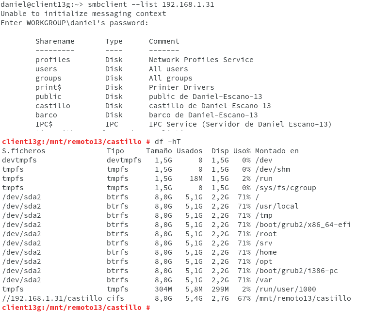  

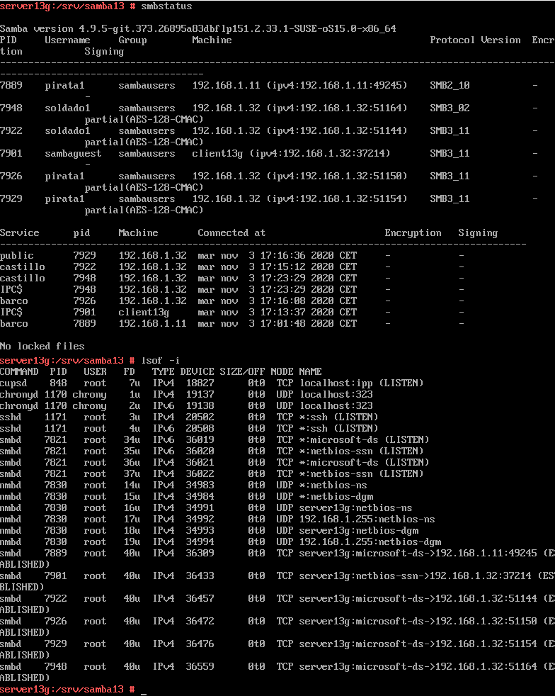  

### 3.3 Montaje automático

Hacer una instantánea de la MV antes de seguir. Por seguridad.

Capturar imágenes del proceso.

Reiniciar la MV.

df -hT. Los recursos ya NO están montados. El montaje anterior fue temporal.

Para configurar acciones de montaje automáticos cada vez que se inicie el equipo, debemos configurar el fichero /etc/fstab. Veamos un ejemplo:

//IP-servidor-samba/public /mnt/remotoXX/public cifs username=soldado1,password=CLAVE-DE-SOLDADO1 0 0

Reiniciar el equipo y comprobar que se realiza el montaje automático al inicio.

Incluir contenido del fichero /etc/fstab en la entrega.

#### Captura del montado de forma automatica desde Linux;

  

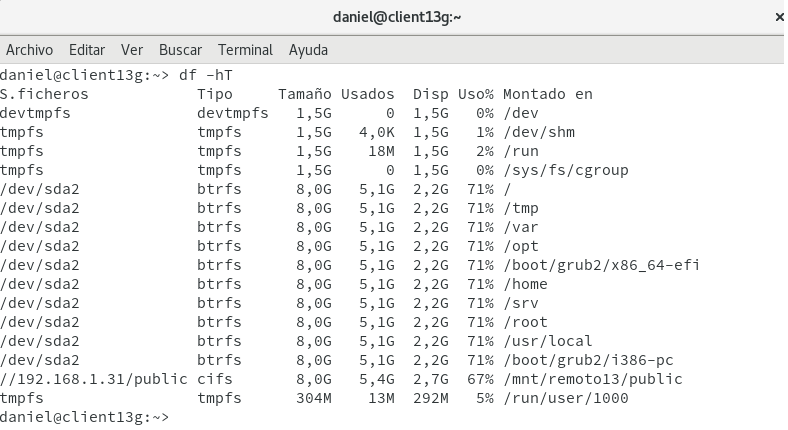  
