# Servidor de Impresion en Windows

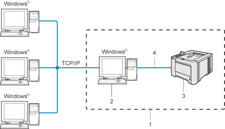

2º ASIR
Daniel Escaño Hernández

## 1. Impresora compartida

### 1.1 Rol Impresión

Vamos al servidor
Instalar rol/función de servidor de impresión.
Incluir impresión por Internet.

#### Capturas de la instalacion del rol de servidor de impresion:

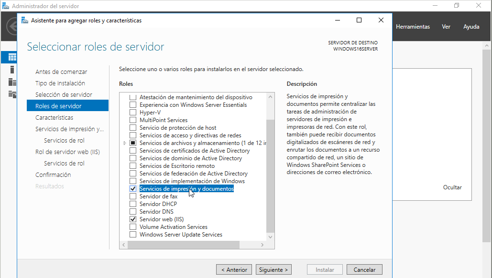

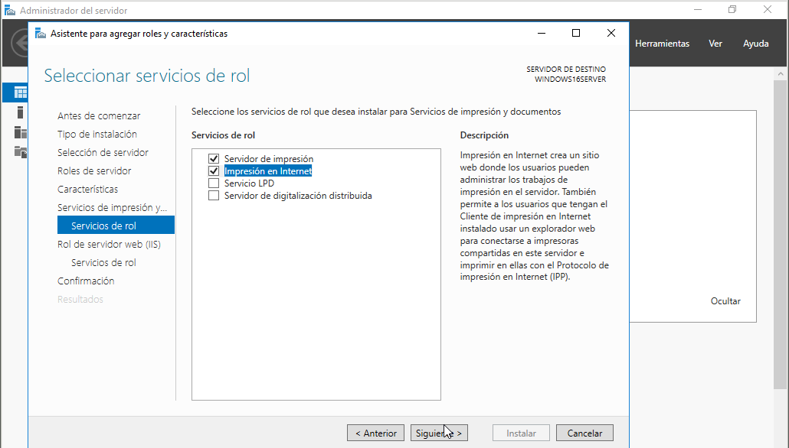

### 1.2 Instalar Impresora PDF

PDFCreator es una utilidad completamente gratuita con la que podrás crear archivos PDF desde cualquier aplicación, desde el Bloc de notas hasta Word, Excel, etc. Este programa funciona simulando ser una impresora, de esta forma, instalando PDFCreator todas tus aplicaciones con opción para imprimir te permitirán crear archivos PDF en cuestión de segundos.

Descargar PDFCreator (URL recomendada www.pdfforge.org/pdfcreator/download) e instalar.
En PDFCreator, configurar en perfiles -> Guardar -> Automático. Ahí establecemos la carpeta destino.

#### Captura de la instalacion de PDFCreator:

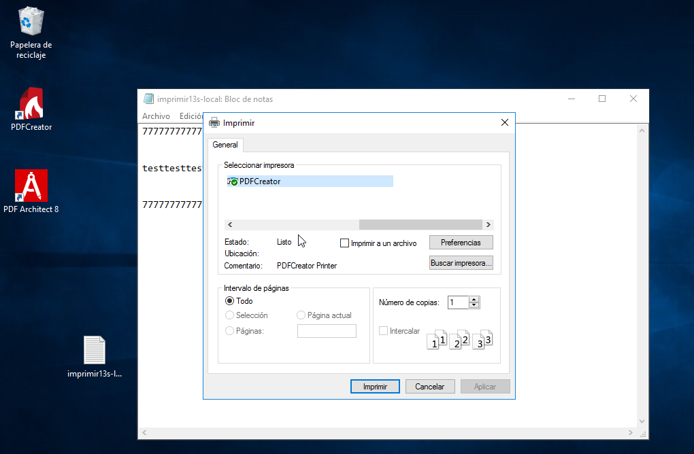

### 1.3 Probar la impresora en local

Para crear un archivo PDF no hará falta que cambies la aplicación que estés usando, simplemente ve a la opción de imprimir y selecciona "Impresora PDF", en segundos tendrás creado tu archivo PDF.

Puedes probar la nueva impresora abriendo el Bloc de notas y creando un fichero luego selecciona imprimir. Cuando finalice el proceso se abrirá un fichero PDF con el resultado de la impresión.

Probar la impresora remota imprimiendo documento imprimirXXs-local.

#### Capturas de la comprobacion del funcionamiento de PDFCreator:

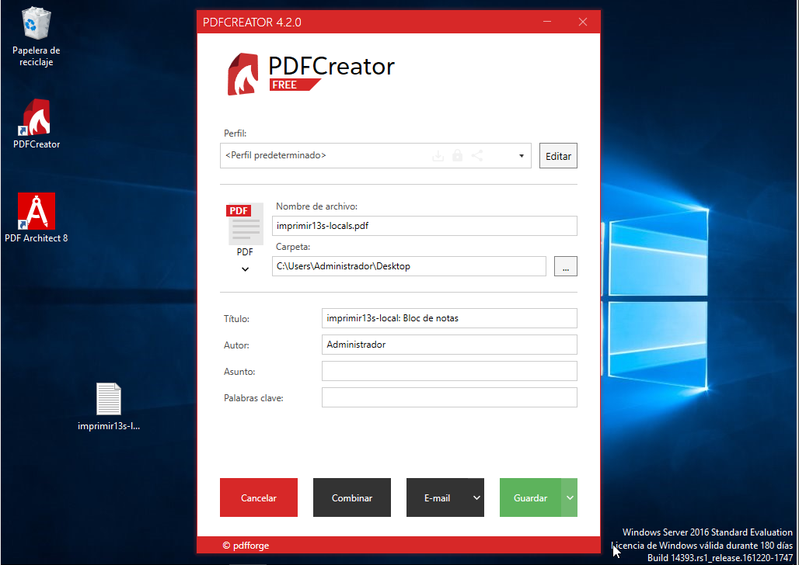

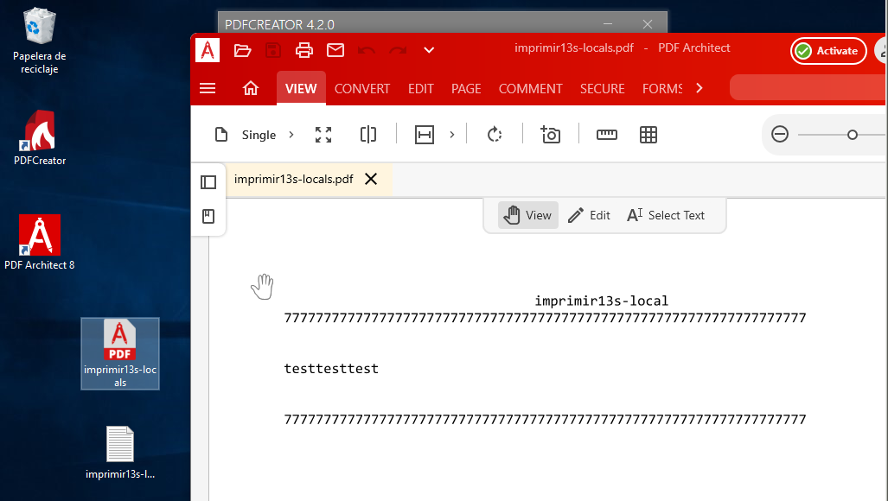

## 2. Compartir por red

### 2.1 En el servidor

Ir al Administrador de Impresión -> Impresoras
Elegir impresora PDFCreator.

  Botón derecho -> Propiedades -> Compartir
  Como nombre del recurso compartido utilizar PDFnombrealumnoXX.

#### Captura del proceso de compartir:

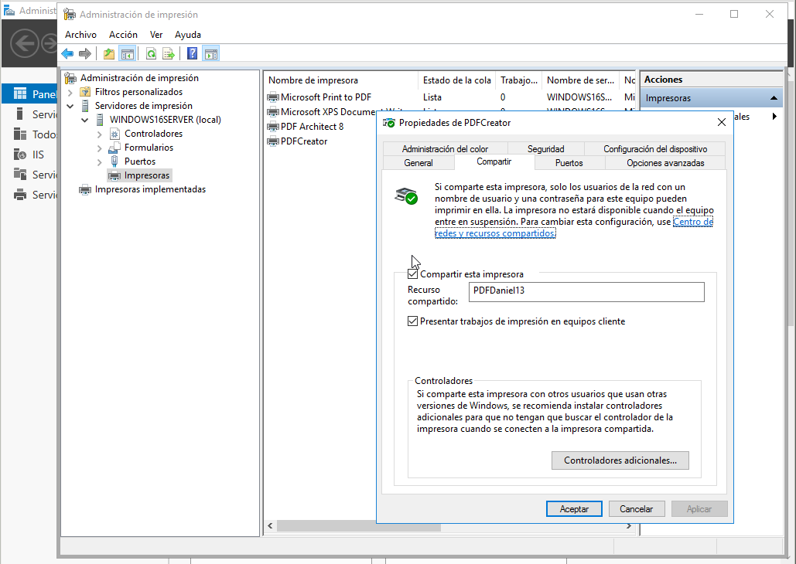

### 2.2 Comprobar desde el cliente

Buscar recursos de red del servidor. Si tarda en aparecer ponemos \\ip-del-servidor en la barra de navegación.
Seleccionar impresora -> botón derecho -> conectar.
  Ponemos usuario/clave del Windows Server.
Ya tenemos la impresora remota configurada en el cliente.
Probar la impresora remota imprimiendo documento imprimirXXw-remoto.

#### Capturas del acceso y funcionamiento desde Windows Cliente:

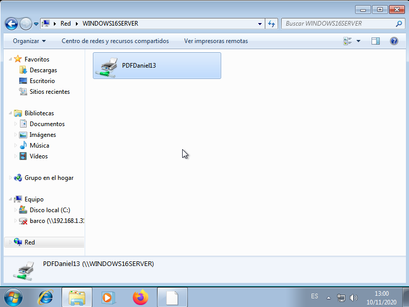

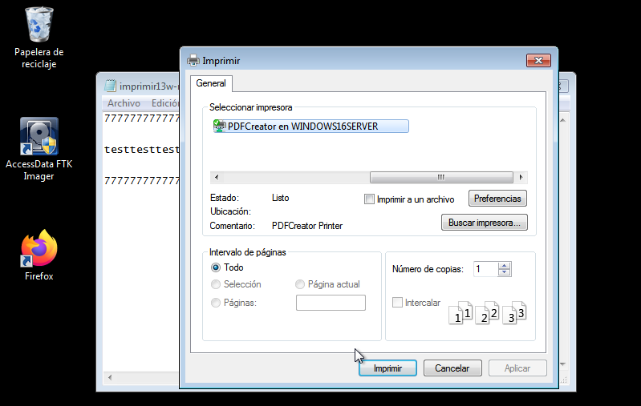

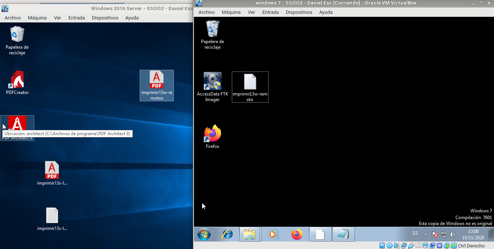

## 3. Acceso Web

### 3.1 Instalar característica impresión WEB

Vamos al servidor.
Nos aseguramos de tener instalado el servicio "Impresión de Internet".

### 3.2 Configurar impresión WEB

Abrimos un navegador Web.
Ponemos URL http://<ip-del-servidor>/printers (o http://<nombre-del-servidor>/printers) para que aparezca en nuestro navegador un entorno que permite gestionar las impresoras de dicho equipo, previa autenticación como uno de los usuarios del habilitados para dicho fin (por ejemplo el "Administrador").
Pincha en la opción propiedades y captura lo que se ve. Apuntar el URL asociado al nombre de red de la impresora para usarlo más adelante.

#### Capturas del acceso web y las propiedades desde Windows Cliente:

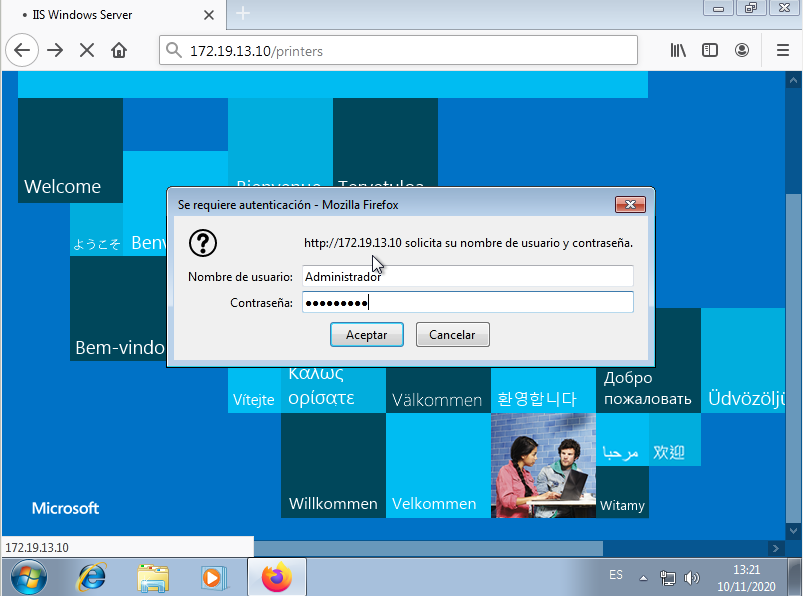

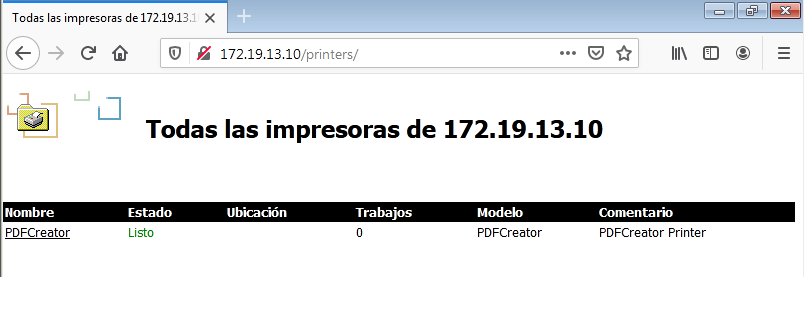

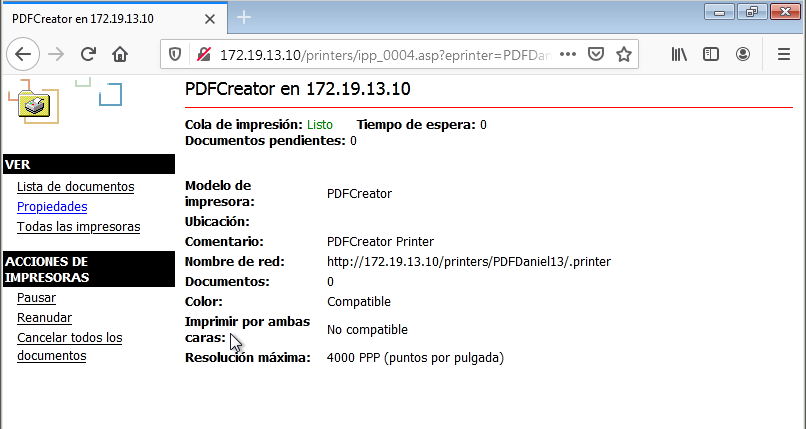

Agregar impresora (NO es local)
Crear nueva impresora usando el URL nombre de red de la impresora anterior.

#### Capturas del acceso y agregado con URL desde Windows Cliente:

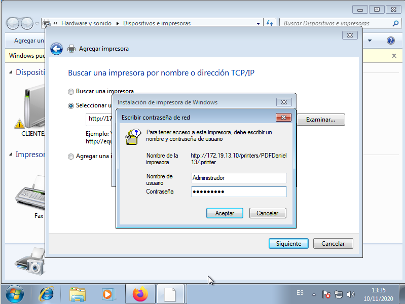

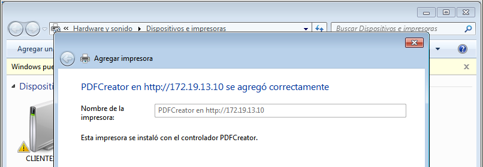

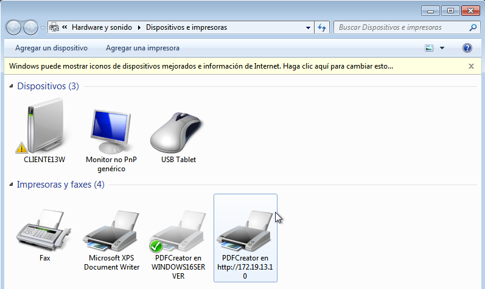

### 3.3 Comprobar desde el navegador

Accede a la configuración de la impresora a través del navegador.

Poner en pausa los trabajos de impresión de la impresora.

#### Capturas de la impresion y de cola de impresion desde Windows Cliente:

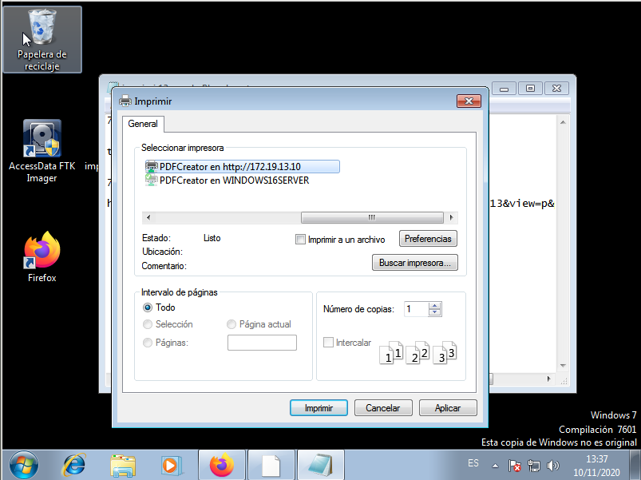

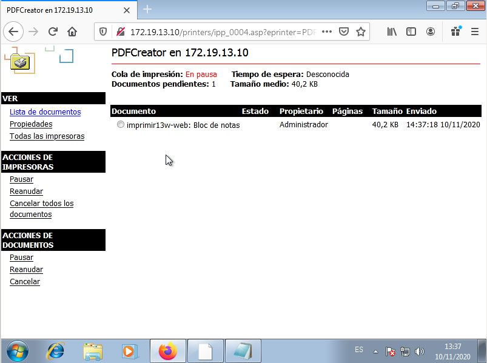

Ir a MV cliente.

Probar la impresora remota imprimiendo documento imprimirXXw-web.

Comprobar que al estar la impresora en pausa, el trabajo aparece en cola de impresión.

Finalmente pulsa en reanudar el trabajo para que tu documento se convierta a PDF.

#### Captura de la comprobacion del correcto funcionamiento:

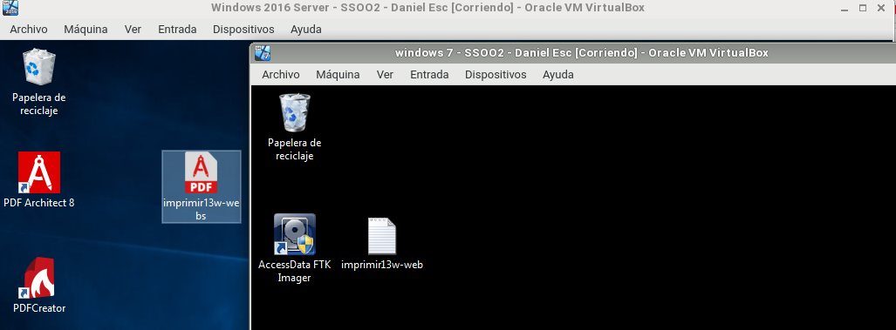

