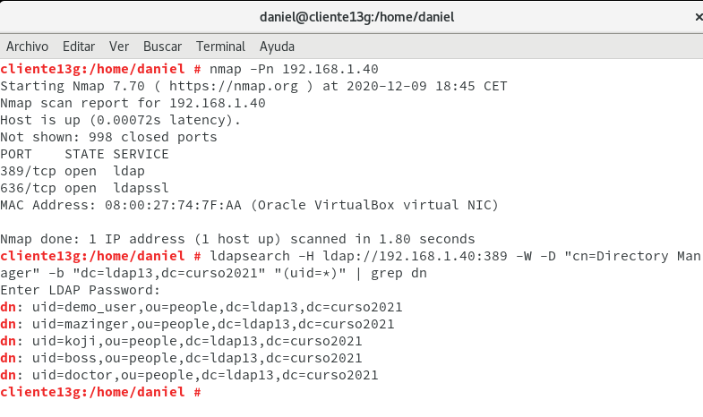
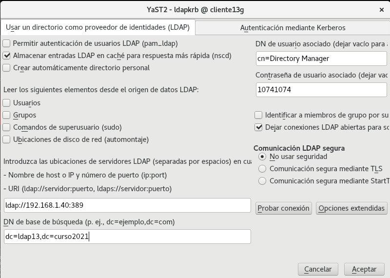
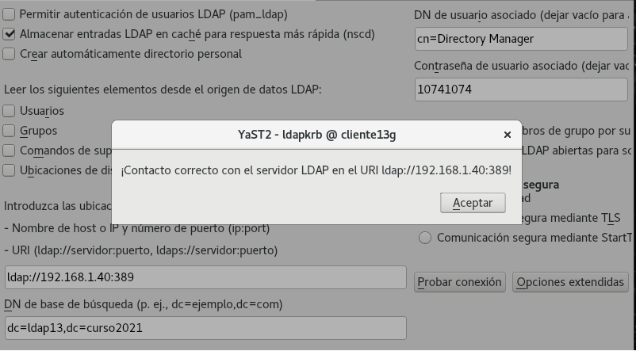
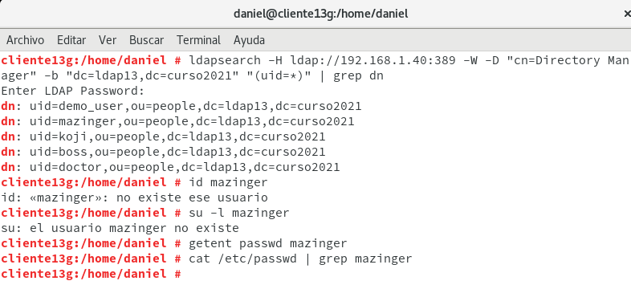

# Cliente para autenticación LDAP

  

Con autenticacion LDAP prentendemos usar la máquina servidor LDAP, como repositorio centralizado de la información de grupos, usuarios, claves, etc. 
Desde otras máquinas conseguiremos autenticarnos (entrar al sistema) con los usuarios definidos no en la máquina local, sino en la máquina remota con LDAP. 

Una especie de Domain Controller.

En esta actividad, vamos a configurar otra MV (GNU/Linux OpenSUSE) para que podamos hacer autenticación en ella,
pero usando los usuarios y grupos definidos en el servidor de directorios LDAP de la MV1

## 1. Preparativos

Supondremos que tenemos una MV1 (serverXX) con DS-389 instalado, y con varios usuarios dentro del DS.

Necesitamos MV2 con SO OpenSUSE (Configuración MV)

Comprobamos el acceso al LDAP desde el cliente:

Ir a MV cliente.

nmap -Pn IP-LDAP-SERVERXX | grep -P '389|636', para comprobar que el servidor LDAP es accesible desde la MV2 cliente.

ldapsearch -H ldap://IP-LDAP-SERVERXX:389 -W -D "cn=Directory Manager" -b "dc=ldapXX,dc=curso2021" "(uid=*)" | grep dn,

Comprobamos que los usuarios del LDAP remoto son visibles en el cliente.

#### Captura de la comprobacion del acceso a LDAP:

  

## 2. Configurar autenticación LDAP

### 2.1 Crear conexión con servidor

Vamos a configurar de la conexión del cliente con el servidor LDAP.

Ir a la MV cliente.

No aseguramos de tener bien el nombre del equipo y nombre de dominio (/etc/hostname, /etc/hosts)

Ir a Yast -> Cliente LDAP y Kerberos.

Configurar como la imagen de ejemplo:

BaseDN: dc=ldapXX,dc=curso2021
DN de usuario: cn=Directory Manager
Contraseña: CLAVE del usuario cn=Directory Manager

#### Capturas de la configuracion y conexion a LDAP:

  

  

#### Captura de los comandos ofrecidos para comprobacion en LDAP:

  