# Servicio de Directorio con comandos

  

## 1. Prerequisitos

Instalacion de LDAP

### 1.1 Nombre de equipo FQDN

    Vamos a usar una MV OpenSUSE para montar nuestro servidor LDAP (Configuración MV).
    Nuestra máquina debe tener un FQDN=serverXXg.curso2021.
        Revisar /etc/hostname
        Revisar /etc/hosts

127.0.0.2   serverXXg.curso2021   serverXXg

    Comprobar salida de: hostname -a, hostname -d y hostname -f.

#### Captura de la comprobacion de hostname:

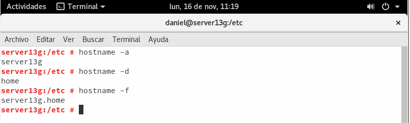

## 2. Instalar el Servidor LDAP
### 2.1 Instalación del paquete

    Abrir una consola como root.
    zypper in 389-ds, instalar el script de instalación.

    rpm -qa | grep 389-ds, comprobar que la versión es >= 1.4.*

    dsctl: Gestiona instancia local (requiere permisos de root). Para iniciar, parar, backup, etc.
    dsconf: Gestiona configuración de instancia local o remota. Require cn=Directory Manager. Cambia la configuración del servidor.
    dsidm: Gestiona contenido dentro de la base de datos

#### Captura de la instalación del servidor LDAP:

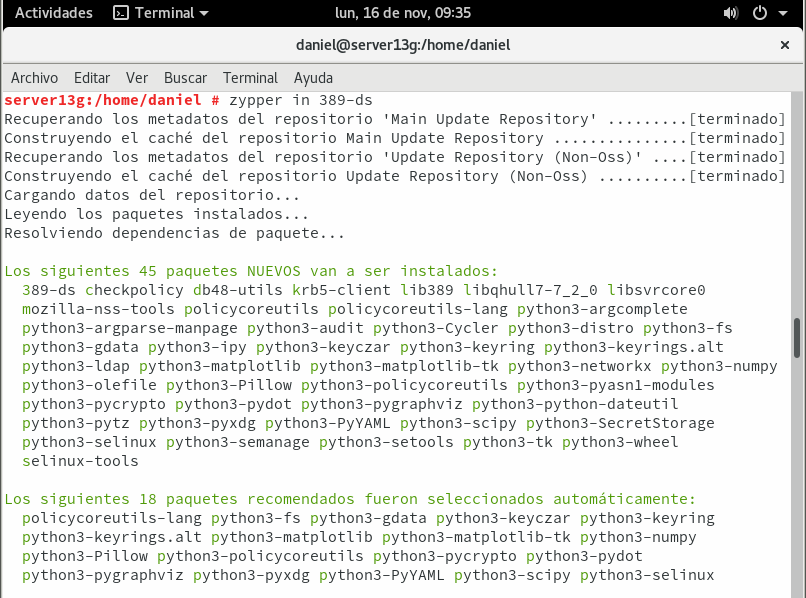

### 2.2 Configurar la instancia

    Crear el fichero /root/instance.inf con el siguiente contenido. Este fichero sirve para configurar el servidor:

#### Captura de la configuracion en el archivo instance.inf

    dscreate -v from-file /root/instance.inf, Now you can install your 389 DS instance with:

    dsctl localhost status, That’s it! You have a working LDAP server. You can show this with:

#### Captura de la creación y estado de la nueva instancia:

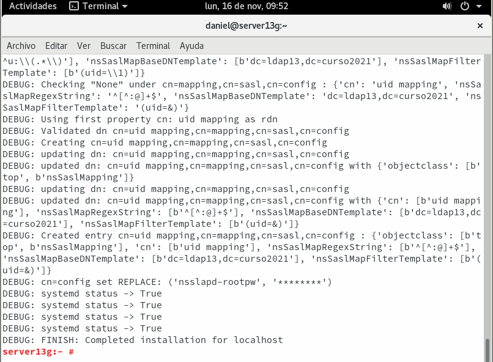

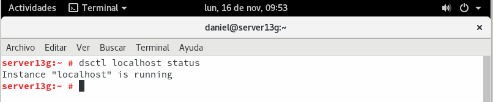

    Creamos el fichero /root/.dsrc con el siguiente contenido. Este fichero sirve para configurar los permisos para acceder a la base de datos como administrador:

#### Captura de la creación del fichero .dsrc:

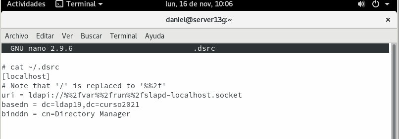

### 2.3 Comprobamos el servicio

    systemctl status dirsrv@localhost, comprobar si el servicio está en ejecución.
    nmap -Pn serverXX | grep -P '389|636', para comprobar que el servidor LDAP es accesible desde la red. En caso contrario, comprobar cortafuegos.

#### Captura de la comprobación servicio y sus puertos:

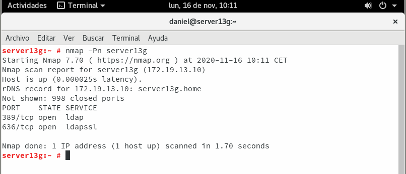

### 2.4 Comprobamos el acceso al contenido del LDAP

    ldapsearch -b "dc=ldapXX,dc=curso2021" -x | grep dn, muestra el contenido de nuestra base de datos LDAP.
    Comprobar que existen las OU Groups y People.
    ldapsearch -H ldap://localhost -b "dc=ldapXX,dc=curso2021" -W -D "cn=Directory Manager" | grep dn, en este caso hacemos la consulta usando usuario/clave.

#### Captura de la comprobación del acceso al contenido del LDAP:

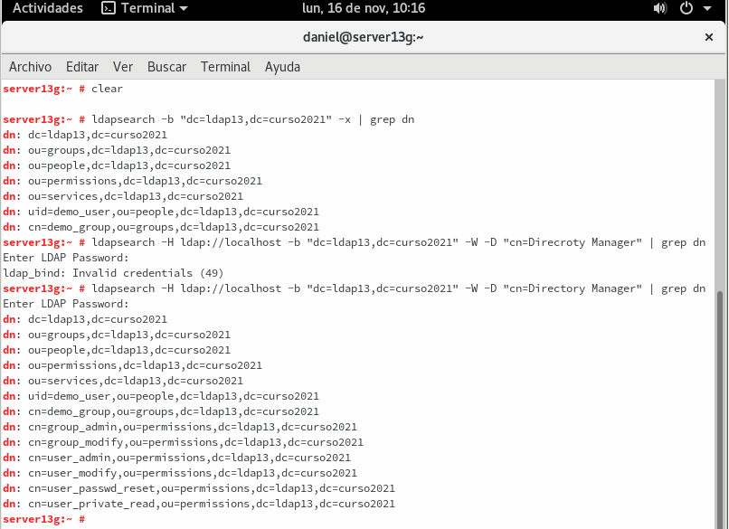

## 3. Añadir usuarios LDAP por comandos

### 3.1 Buscar Unidades Organizativas

Deberían estar creadas las OU People y Groups, es caso contrario hay que crearlas (Consultar ANEXO). Ejemplo para buscar las OU:

ldapsearch -H ldap://localhost:389 -W -D "cn=Directory Manager" -b "dc=ldapXX,dc=curso2021" "(ou=*)" | grep dn

#### Captura de la búsqueda de Unidades Organizativas:

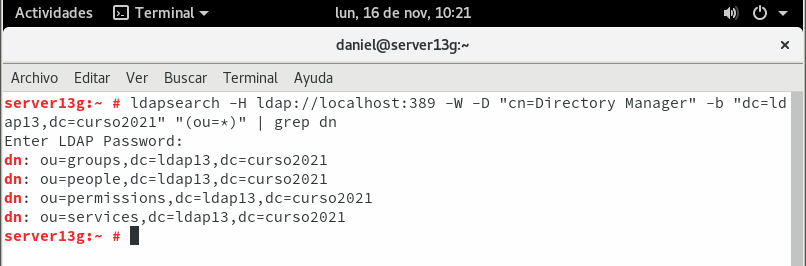

### 3.2 Agregar usuarios

Uno de los usos más frecuentes para el directorio LDAP es para la administración de usuarios. Vamos a utilizar ficheros ldif para agregar usuarios.

    Fichero mazinger-add.ldif con la información para crear el usuario mazinger

ldapadd -x -W -D "cn=Directory Manager" -f mazinger-add.ldif , escribir los datos del fichero ldif anterior en LDAP.

#### Captura de la configuración y adición del archivo mazinger-add.ldif:

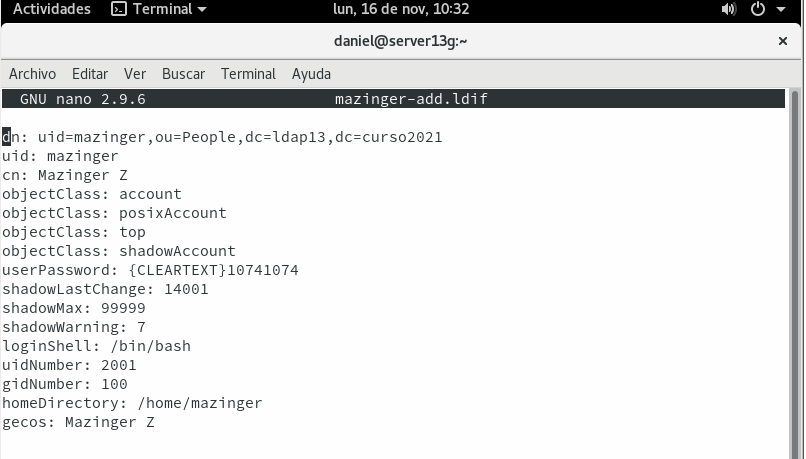

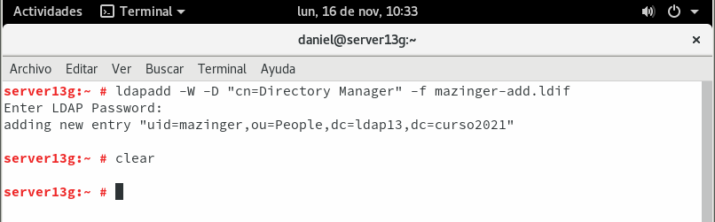

### 3.3 Comprobar el nuevo usuario

    ldapsearch -W -D "cn=Directory Manager" -b "dc=ldapXX,dc=curso2021" "(uid=*)", para comprobar si se ha creado el usuario en el LDAP.

Estamos usando la clase posixAccount, para almacenar usuarios dentro de un directorio LDAP. Dicha clase posee el atributo uid. Por tanto, para listar los usuarios de un directorio, podemos filtrar por "(uid=*)".

#### Captura de la comprobacion de la creacion del usuario mazinger:

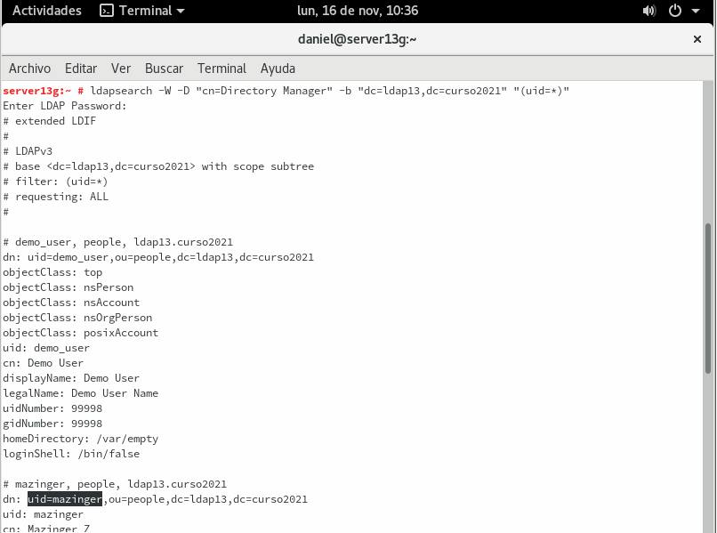

## 4. Contraseñas encriptadas

En el ejemplo anterior la clave se puso en texto plano. Cualquiera puede leerlo y no es seguro. Vamos generar valores de password encriptados.

### 4.1 TEORIA: Herramienta slappasswd

Ejecutar zypper in openldap2, para instalar la heramienta slappasswd en OpenSUSE.
La herramienta slappasswd provee la funcionalidad para generar un valor userPassword adecuado. Con la opción -h es posible elegir uno de los siguientes esquemas para almacenar la contraseña:

    {CLEARTEXT} (texto plano),
    {CRYPT} (crypt),
    {MD5} (md5sum),
    {SMD5} (MD5 con salt),
    {SHA} (1ssl sha) y
    {SSHA} (SHA-1 con salt, esquema por defecto).

#### Captura de la instalación de slappasswd y creación de contraseñas cifradas:

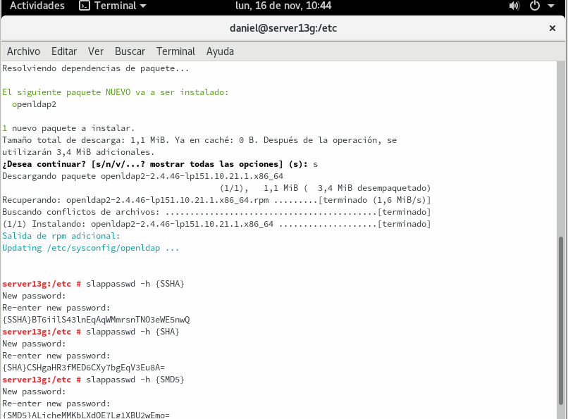

### 4.2 Agregar más usuarios

Agregar más usuarios:

    Ir a la MV servidor LDAP.
    Crear los siguientes usuarios en LDAP con clave encriptada:

Full name 		    Login acount 	uid
Koji Kabuto 	   	koji 		        2002
Boss 	      	   	boss 	         	2003
Doctor Infierno 	drinfierno    		2004

#### Captura de la creación del usuario Koji Kabuto:

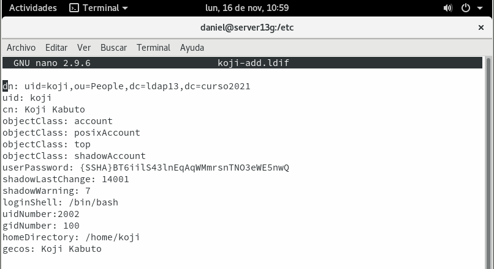

#### Captura de la creación del usuario Boss:

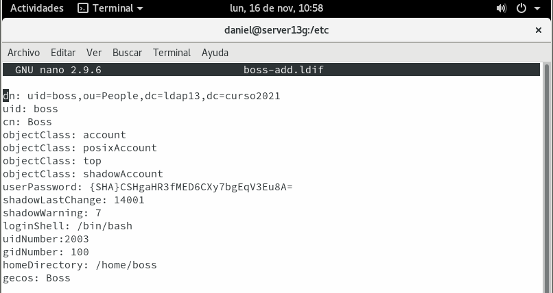

#### Captura de la creación del usuario Doctor Infierno:

#### Captura la adicion de los tres usuarios a LDAP:

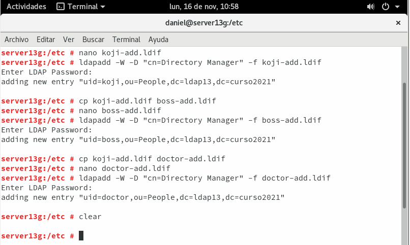

### 4.3 Comprobar los usuarios creados

    Ir a la MV cliente LDAP.
    Ejecutar comando ldpasearch ... "(uid=*)" | grep dn para consultar los usuarios LDAP en el servidor de directorios remoto.

#### Captura de la comprobacion de los usuarios creados correctamente:

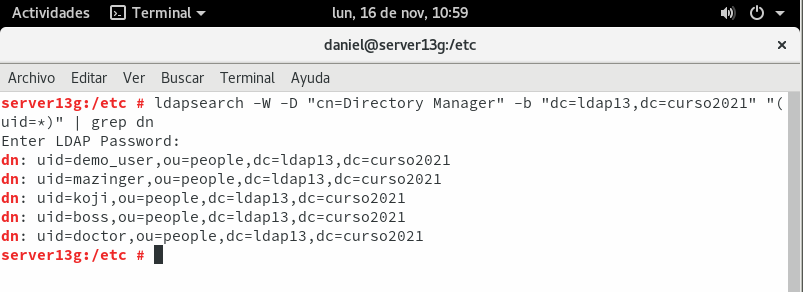