# Salt-stack

  

Daniel Escaño Hernández

## 1 Preparativos

Config			MV1		MV2		MV3
Hostname		masterXXg	minionXXg	minionXXw
SO			OpenSUSE	OpenSUSE	Windows
IP			172.19.XX.31	172.19.XX.32	172.19.XX.11

## 2. Master: Instalar y configurar

Ir a la MV1
zypper install salt-master, instalar el software del Máster.
dsidm: Gestiona contenido dentro de la base de datos

#### Captura de la instalacion:

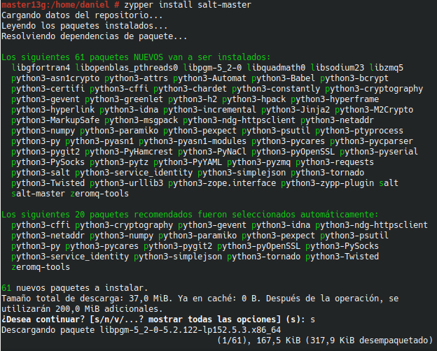

Modificar /etc/salt/master para configurar nuestro Máster con:

interface: 172.19.XX.31
file_roots:
  base:
    - /srv/salt

systemctl enable salt-master.service, activiar servicio en el arranque del sistema.
systemctl start salt-master.service, iniciar servicio.
salt-key -L, para consultar Minions aceptados por nuestro Máster. Vemos que no hay ninguno todavía.

#### Capturas del configuracion del master:

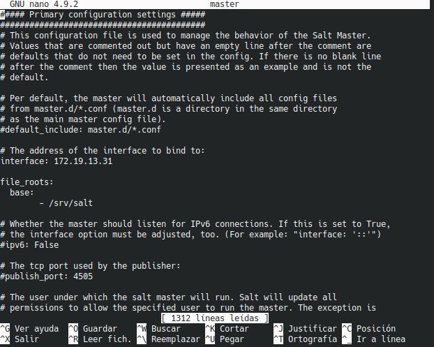

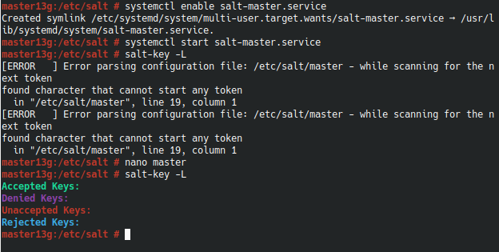

## 3. Minion
### 3.1 Instalación y configuración

zypper install salt-minion, instalar el software del agente (minion).
Modificar /etc/salt/minion para definir quien será nuestro Máster:

master: 172.19.XX.31

systemctl enable salt-minion.service, activar Minion en el arranque del sistema.
systemctl start salt-minion.service, iniciar el servico del Minion.
Comprobar que que no tenemos instalado apache2 en el Minion.

#### Captura de la instalacion y configuracion del minion:

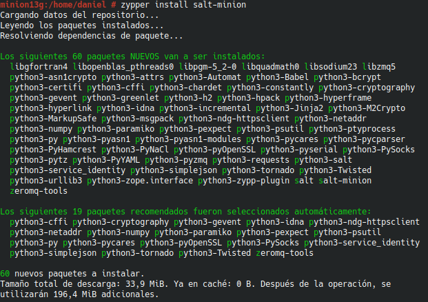

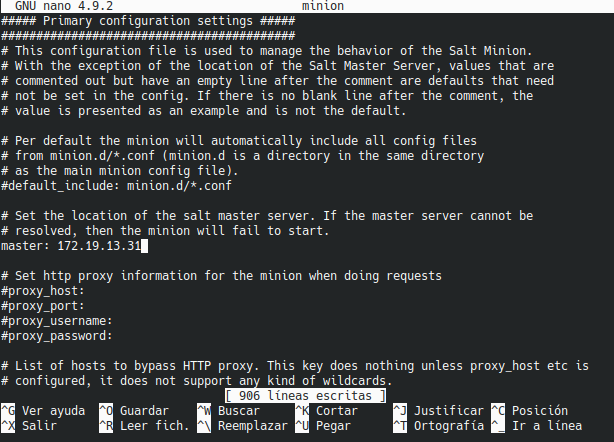

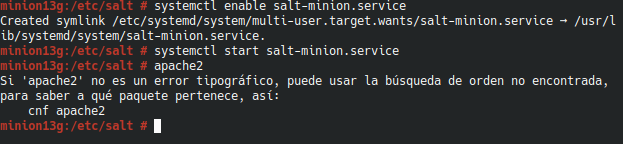

### 3.2 Cortafuegos

Ir a la MV1 Máster.
firewall-cmd --get-active-zones, consultar la zona de red. El resultado será public, dmz o algún otro. Sólo debe aplicar a las zonas necesarias.
firewall-cmd --zone=public --add-port=4505-4506/tcp --permanent, abrir puerto de forma permanente en la zona "public".
firewall-cmd --reload, reiniciar el firewall para que los cambios surtan efecto. (También vale con systemctl firewalld reload)
firewall-cmd --zone=public --list-all, para consultar la configuración actual la zona public.

#### Captura de la configuración del firewall:

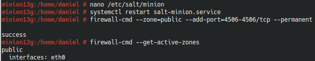

### 3.3 Aceptación desde el Master

Ir a MV1:

salt-key -L, vemos que el Máster recibe petición del Minion.
salt-key -a minionXXg, para que el Máster acepte a dicho Minion.
salt-key -L, comprobamos.

#### Captura de la comprobación del agregado:

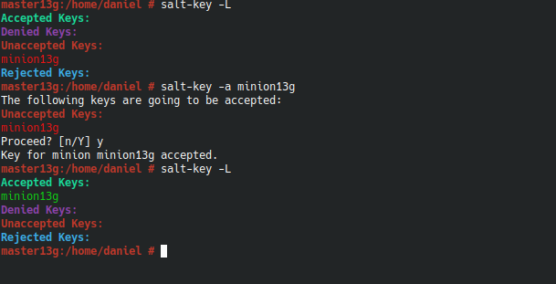

### 3.4 Comprobamos conectividad

Desde el Máster comprobamos:

Conectividad hacia los Minions.
# salt '*' test.ping
minionXXg:
    True

Versión de Salt instalada en los Minions
# salt '*' test.version
minionXXg:
    3000

#### Capturas de la comprobaciones:

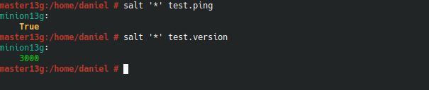

## 4. Salt States

### 4.1 Preparar el directorio para los estados

Vamos a crear directorios para guardar lo estados de Salt. Los estados de Salt son definiciones de cómo queremos que estén nuestras máquinas.

Ir a la MV Máster:

Crear directorios /srv/salt/base y /srv/salt/devel.
base = para guardar nuestros estados.
devel = para desarrollo o para hacer pruebas.
Crear archivo /etc/salt/master.d/roots.conf con el siguiente contenido:
file_roots:
  base:
    - /srv/salt/base
  devel:
    - /srv/salt/devel
Reiniciar el servicio del Máster.

#### Captura de la creación del archivo de configuración:

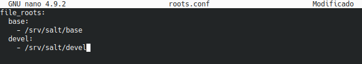

### 4.2 Crear un nuevo estado

Los estados de Salt se definen en ficheros SLS.

Crear fichero /srv/salt/base/apache/init.sls:
install_apache:
  pkg.installed:
    - pkgs:
      - apache2

apache_service:
  service.running:
    - name: apache2
    - enable: True
    - require:
      - install_apache

#### Captura de la creación del fichero de estado apache:

### 4.3 Asociar Minions a estados

Ir al Máster:

Crear /srv/salt/base/top.sls, donde asociamos a todos los Minions con el estado que acabamos de definir.
base:       
  '*':
    - apache

#### Captura de la asociación:

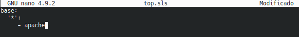

### 4.4 Comprobar: estados definidos

salt '*' state.show_states, consultar los estados que tenemos definidos para cada Minion:
minionXXg:
    - apache

#### Captura de la comprobación de estado:

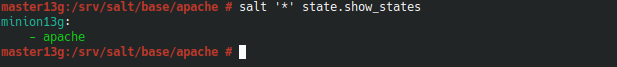

### 4.5 Aplicar el nuevo estado

Ir al Master:

Consultar los estados en detalle y verificar que no hay errores en las definiciones.
salt '*' state.show_lowstate
salt '*' state.show_highstate,
salt '*' state.apply apache, para aplicar el nuevo estado en todos los minions.

#### Captura de la consulta y aplicación del estado:

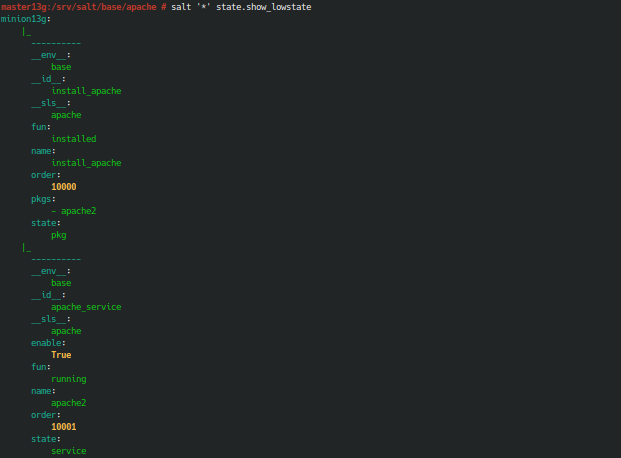

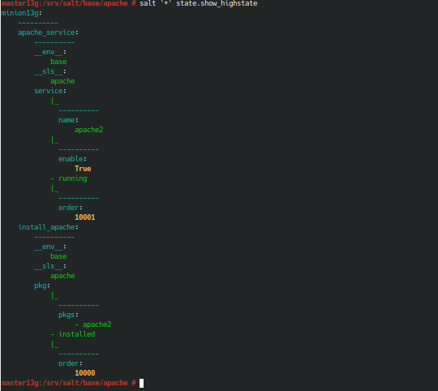

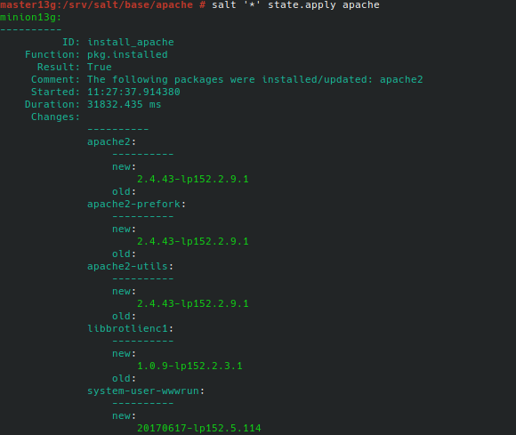

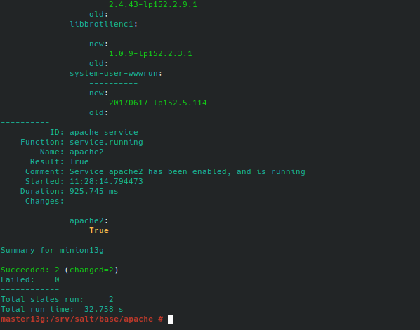

## 5. Crear más estados

### 5.1 Crear estado "users"

Vamos a crear un estado llamado users que nos servirá para crear un grupo y usuarios en las máquinas Minions (ver ejemplos en el ANEXO).

Crear directorio /srv/salt/base/users.
Crear fichero /srv/salt/base/users/init.sls con las definiciones para crear los siguiente:
Grupo mazingerz
Usuarios kojiXX, drinfiernoXX dentro de dicho grupo.
Aplicar el estado.

#### Captura de la creación del fichero y la aplicación del estado users:

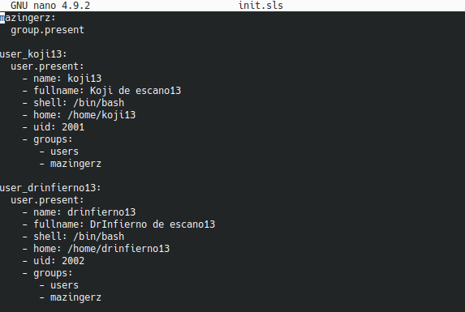

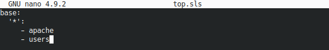

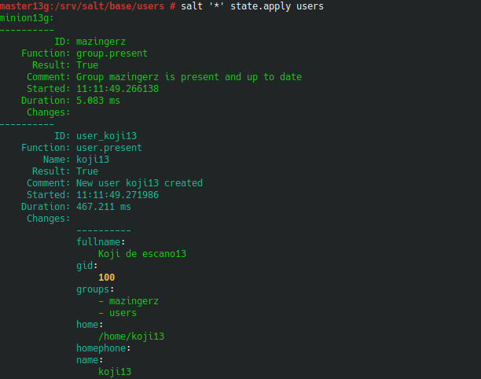
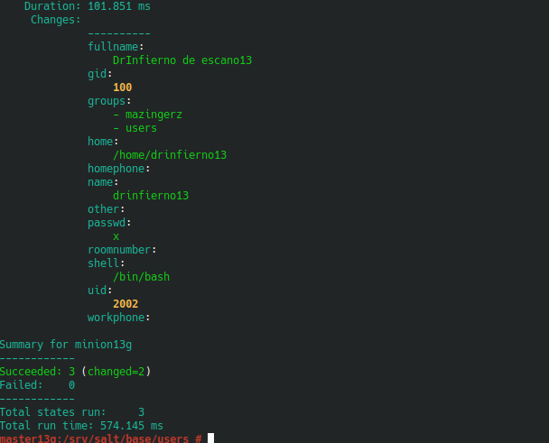

### 5.2 Crear estado "dirs"

Crear estado dirs para crear las carpetas private (700), public (755) y group (750) en el HOME del usuario koji (ver ejemplos en el ANEXO).
Aplicar el estado dirs.

#### Captura de la creación del fichero y la aplicación del estado dirs:

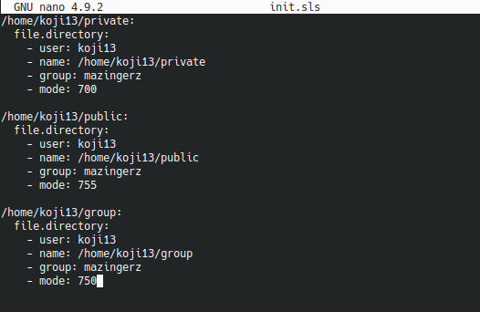

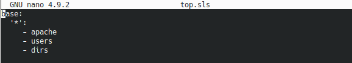

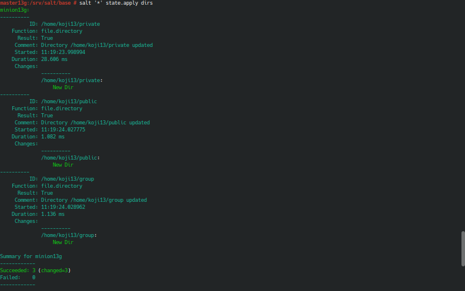

### 5.3 Ampliar estado "apache"

Crear el fichero /srv/salt/base/files/holamundo.html. Escribir dentro el nombre del alumno y la fecha actual.
Incluir en el estado "apache" la creación del fichero "holamundo" en el Minion. Dicho fichero se descargará desde el servidor Salt Máster y se copiará en el Minion.
holamundo:
  file.managed:
    - name: /srv/www/htdocs/holamundo.html
    - source: salt://files/holamundo.html
Ir al master y aplicar el estado "apache".

