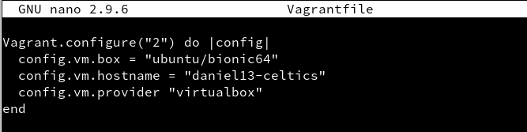
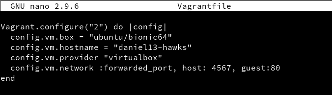
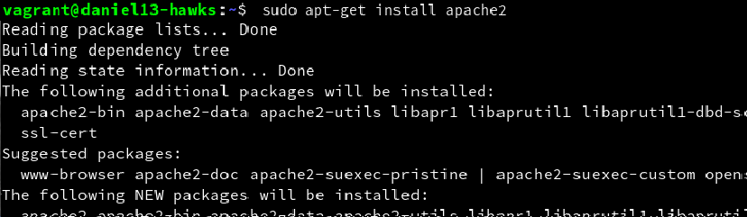
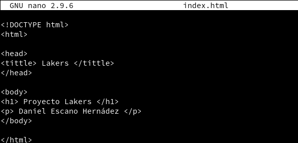
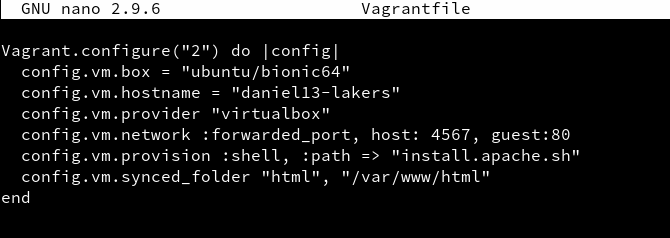
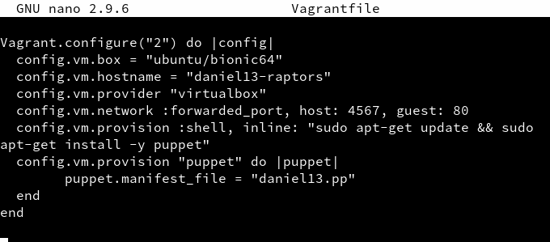
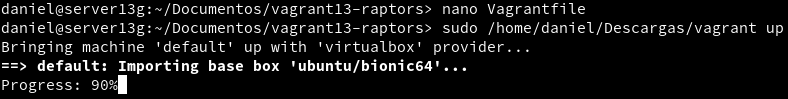

# Vagrant con VirtualBox

  

## 1. Introducción

Vagrant es una herramienta para la creación y configuración de entornos de desarrollo virtualizados.

Originalmente se desarrolló para VirtualBox y sistemas de configuración tales como Chef, Salt y Puppet.

Sin embargo desde la versión 1.1 Vagrant es capaz de trabajar con múltiples proveedores, como VMware, Amazon EC2, LXC, DigitalOcean, etc.2

Aunque Vagrant se ha desarrollado en Ruby se puede usar en multitud de proyectos escritos en otros lenguajes.

## 2. Instalar Vagrant

Instalar Vagrant. La instalación vamos a hacerla en una máquina real.

Hay que comprobar que las versiones de Vagrant y VirtualBox son compatibles entre sí.

vagrant version, para comprobar la versión actual de Vagrant.

VBoxManage -v, para comprobar la versión actual de VirtualBox.

## 3. Proyecto Celtics

### 3.1 Imagen, caja o box

vagrant box add BOXNAME, descargar la caja que necesitamos a través de vagrant.

vagrant box list, lista las cajas/imágenes disponibles actualmente en nuestra máquina.

### 3.2 Directorio

Crear un directorio para nuestro proyecto. Donde XX es el número de cada alumno:

Crear el fichero Vagrantfile de la siguiente forma:

### 3.3 Comprobar

Debemos estar dentro de vagrantXX-celtics.

vagrant up, para iniciar una nueva instancia de la máquina.

vagrant ssh: Conectar/entrar en nuestra máquina virtual usando SSH.

## 4. TEORÍA

A continuación se muestran ejemplos de configuración Vagrantfile que NO ES NECESARIO hacer. Sólo es información.

Enlace de interés Tutorial Vagrant. ¿Qué es y cómo usarlo?

Carpetas compartidas

La carpeta del proyecto que contiene el Vagrantfile es visible para el sistema el virtualizado, esto nos permite compartir archivos fácilmente entre los dos entornos.

Ejemplos para configurar las carpetas compartidas:

config.vm.synced_folder ".", "/vagrant": La carpeta del proyecto es accesible desde /vagrant de la MV.

config.vm.synced_folder "html", "/var/www/html". La carpeta htdocs del proyecto es accesible desde /var/www/html de la MV.

Redireccionamiento de los puertos

Cuando trabajamos con máquinas virtuales, es frecuente usarlas para proyectos enfocados a la web, y para acceder a las páginas es necesario configurar el enrutamiento de puertos.

config.vm.network "private_network", ip: "192.168.33.10": Ejemplo para configurar la red.

Conexión SSH: Ejemplo para personalizar la conexión SSH a nuestra máquina virtual:

config.ssh.username = 'root'
config.ssh.password = 'vagrant'
config.ssh.insert_key = 'true'
Ejemplo para configurar la ejecución remota de aplicaciones gráficas instaladas en la máquina virtual, mediante SSH:

config.ssh.forward_agent = true
config.ssh.forward_x11 = true

## 5. Proyecto Hawks

### 5.1 Creamos proyecto Hawks

Crear carpeta vagrantXX-hawks. Entrar en el directorio.

Crear proyecto Vagrant.

Configurar Vagrantfile para usar nuestra caja BOXNAME y hostname = "nombre-alumnoXX-hawks".

Modificar el fichero Vagrantfile, de modo que el puerto 4567 del sistema anfitrión sea enrutado al puerto 80 del ambiente virtualizado.

config.vm.network :forwarded_port, host: 4567, guest: 80

vagrant ssh, entramos en la MV

Instalamos apache2.

### 5.2 Comprobar

En el HOST-CON-VAGRANT (Máquina real). Comprobaremos que el puerto 4567 está a la escucha.

vagrant port para ver la redirección de puertos de la máquina Vagrant.

En HOST-CON-VAGRANT, abrimos el navegador web con el URL http://127.0.0.1:4567. 

En realidad estamos accediendo al puerto 80 de nuestro sistema virtualizado.

## 6. Suministro

Una de los mejores aspectos de Vagrant es el uso de herramientas de suministro. 

Esto es, ejecutar "una receta" o una serie de scripts durante el proceso de arranque del entorno virtual para instalar, configurar y personalizar un sin fin de aspectos del SO del sistema anfitrión.

vagrant halt, apagamos la MV.

vagrant destroy y la destruimos para volver a empezar.

### 6.1 Proyecto Lakers (Suministro mediante shell script)

Crear directorio vagrantXX-lakers para nuestro proyecto.

Entrar en dicha carpeta.

Crear la carpeta html y crear fichero html/index.html con el siguiente contenido:

Crear el script install_apache.sh, dentro del proyecto con el siguiente contenido:

Incluir en el fichero de configuración Vagrantfile lo siguiente:

config.vm.hostname = "nombre-alumnoXX-lakers"

config.vm.provision :shell, :path => "install_apache.sh", para indicar a Vagrant que debe ejecutar el script install_apache.sh dentro del entorno virtual.

config.vm.synced_folder "html", "/var/www/html", para sincronizar la carpeta exterior html con la carpeta interior. De esta forma el fichero "index.html" será visible dentro de la MV.

vagrant up, para crear la MV.

Para verificar que efectivamente el servidor Apache ha sido instalado e iniciado, abrimos navegador en la máquina real con URL http://127.0.0.1:4567.

### 6.2 Proyecto Raptors (Suministro mediante Puppet)

Crear directorio vagrantXX-raptors como nuevo proyecto Vagrant.

Modificar el archivo Vagrantfile de la siguiente forma:

Crear la carpeta manifests.

Crear el fichero manifests/nombre-del-alumnoXX.pp, con las órdenes/instrucciones Puppet necesarias para instalar el software que elijamos

## 7. Proyecto Bulls

### 7.1 Preparar la MV VirtualBox

En los apartados anteriores hemos descargado una caja/box de un repositorio de Internet, y la hemos personalizado. 

En este apartado vamos a crear nuestra propia caja/box a partir de una MV de VirtualBox que tengamos.

Ir a la MV de VirtualBox.

Crear el usuario vagranten la MV.

su
useradd -m vagrant

Poner clave "vagrant" al usuario vagrant.

Poner clave "vagrant" al usuario root.

Configuramos acceso por clave pública al usuario vagrant:

mkdir -pm 700 /home/vagrant/.ssh, creamos la carpeta de configuración SSH.

wget --no-check-certificate 'https://raw.github.com/mitchellh/vagrant/master/keys/vagrant.pub' -O /home/vagrant/.ssh/authorized_keys, descargamos la clave pública.

chmod 0600 /home/vagrant/.ssh/authorized_keys, modificamos los permisos de la carpeta.

chown -R vagrant /home/vagrant/.ssh, modificamos el propietario de la carpeta.

Tenemos que conceder permisos al usuario vagrant para que pueda hacer tareas privilegiadas como configurar la red,

instalar software, montar carpetas compartidas, etc. Para ello debemos configurar el fichero /etc/sudoers 

Añadir vagrant ALL=(ALL) NOPASSWD: ALL al fichero de configuración /etc/sudoers.

